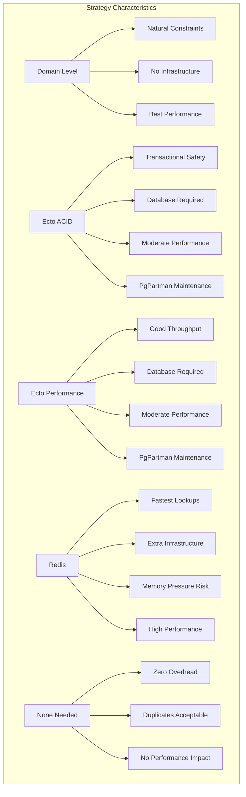
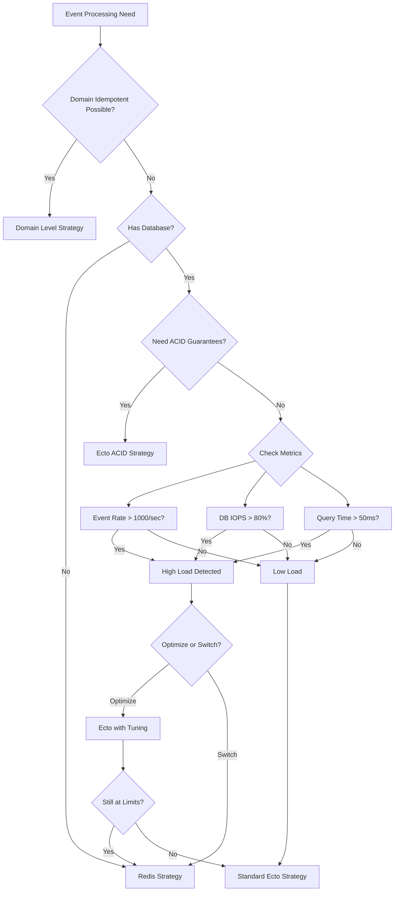
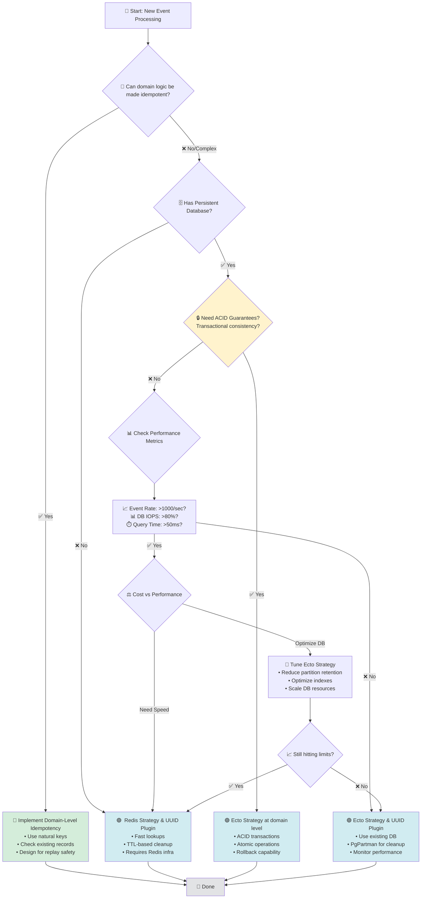

<!--
title: "Idempotency Strategy Selection"
category: "Architecture Patterns"
difficulty: "Intermediate"
tags: ["idempotency", "kafka", "event-processing", "inbox-pattern", "ecto", "redis"]
last_updated: "2025-08-15"
-->

# Selecting the Right Idempotency Strategy

This guide provides rules of thumb for selecting the correct idempotency strategy when processing events, messages, or commands. The focus is on **Inbox Pattern** usage and when to prefer other approaches.

## 🚀 TL;DR

1. **Make domain logic idempotent** if possible.  
2. If not, and you have a DB → [Ecto Strategy](#a-database-based-ecto-strategy).  
3. If no DB → [Redis Strategy](#b-redis-based).  
4. If DB is under load → Switch to [Redis Strategy](#b-redis-based).

## Core Principle

> **Always aim for _domain-level idempotency_ first**  
> Infrastructure patterns like the Inbox Pattern help, but **they do not guarantee true idempotency**.  
> Idempotency is best achieved when your domain logic itself prevents duplicates.

Example:  
If you create a `log` based on an `appointment` event,  
check if a log for the given event **already exists** before creating it.

## Rules of Thumb

### 1. Domain-Level Idempotency First

* Try to design business logic so that **processing the same event multiple times has no side effects**.
* Use natural keys or unique constraints in your domain to prevent duplicates.

### 2. Inbox Pattern

Use the Inbox Pattern when:

* Events **can be retried** due to failures or redelivery.
* You want to **persist processed message UUIDs** to skip duplicates.
* Your service **already has a database** and you want to avoid introducing extra infrastructure.

### 3. Choosing the Right Implementation

#### A. Database-Based (Ecto Strategy)

> 📚 **Implementation**: See [Kafkaesque.Inbox.EctoStrategy](https://github.com/surgeventures/kafkaesque_addons) for the complete implementation.

✅ **Use when**:

* Your app already has a persistent DB and it doesn't have [write IOPS spikes](https://app.datadoghq.com/dashboard/38a-gjd-5cy/production--rds?fromUser=false&fullscreen_end_ts=1755186779814&fullscreen_paused=false&fullscreen_refresh_mode=sliding&fullscreen_section=overview&fullscreen_start_ts=1754581979814&fullscreen_widget=6005631293759154&graph-explorer__tile_def=N4IgbglgXiBcIBcIFsCmBnVAnCGQBoQtUBHAVwwXTgG1R0EBPAG1TlAAcBDVhBN%2BABMA9gHMA%2BgGNmXdOgiSCiRhwEh0w5hEFKA7toQALOCAB2wrMh4gAvoSaqTW020LlsuarDohBXBFziGmRYkmpoCDiS1ISmXGgm7liMAIxKSYwmXGCisFy66AB0WIJFujj84hDCHOjAqKaQWMKmaKYIsBzNgmSSSC34AASCAEYcIRzCmJ04Vsk2gyOMg8CjEKYMXKZh2g1IAGa4WDaFslLCZO0AFACUtgC6hMTokxuo4vsWVggmSGiYODwhE%2BljIMi8PhByDBXESFGSaRs9yRNiAA&refresh_mode=paused&watchdog-explains__open=true&from_ts=1753956060000&to_ts=1753971720000&live=false)
* You want **no extra infrastructure** — reuse your existing DB.

💡 **Pros**:

* No additional services to manage.
* Leverages existing DB reliability.

⚠️ **Watch out for**:

* DB performance under **high-throughput** event streams.
* Possible table bloat if Inbox table is not pruned.
* We use PgPartman so remember about maintenance tasks:

🚨 **Common Issues**:

* **Problem**: Inbox table performance degrading over time
* **Solution**: Consider decreasing partition retention from weekly to daily or 3-day partitions for high-volume scenarios:

* **Problem**: Partition maintenance causing processing delays
* **Solution**: Schedule `partman.run_maintenance()` during low-traffic periods and monitor execution time


```sql
SELECT partman.run_maintenance();
```

#### B. Redis-Based

> 📚 **Implementation**: See [Kafkaesque.Inbox.RedisStrategy](https://github.com/surgeventures/kafkaesque_addons) for the complete implementation.

✅ **Use when**:

* Your app has **no persistent DB**.
* You need **fast lookups** with low-latency idempotency checks.
* Event throughput is high and DB is **near capacity**, e.g. you can evaluate [write IOPS spikes](https://app.datadoghq.com/dashboard/38a-gjd-5cy/production--rds?fromUser=false&fullscreen_end_ts=1755186779814&fullscreen_paused=false&fullscreen_refresh_mode=sliding&fullscreen_section=overview&fullscreen_start_ts=1754581979814&fullscreen_widget=6005631293759154&graph-explorer__tile_def=N4IgbglgXiBcIBcIFsCmBnVAnCGQBoQtUBHAVwwXTgG1R0EBPAG1TlAAcBDVhBN%2BABMA9gHMA%2BgGNmXdOgiSCiRhwEh0w5hEFKA7toQALOCAB2wrMh4gAvoSaqTW020LlsuarDohBXBFziGmRYkmpoCDiS1ISmXGgm7liMAIxKSYwmXGCisFy66AB0WIJFujj84hDCHOjAqKaQWMKmaKYIsBzNgmSSSC34AASCAEYcIRzCmJ04Vsk2gyOMg8CjEKYMXKZh2g1IAGa4WDaFslLCZO0AFACUtgC6hMTokxuo4vsWVggmSGiYODwhE%2BljIMi8PhByDBXESFGSaRs9yRNiAA&refresh_mode=paused&watchdog-explains__open=true&from_ts=1753956060000&to_ts=1753971720000&live=false) for a week. A `max` spike leaving less than 20% of IOPS can be a reason to choose Redis

💡 **Pros**:

* Extremely fast.
* Simple to scale.
* Minimal management overhead.

⚠️ **Watch out for**:

* Requires separate Redis infrastructure which can be expensive.
* Events may be evicted from Redis if the instance is too full.
* Redis can not be used for ACID transactions.

🚨**Common Issues**:

* **Problem**: Events being evicted due to memory pressure
* **Solution**:
    - Monitor Redis memory usage: `INFO memory`
    - Adjust TTL for idempotency keys (recommended: 24-72 hours)
    - Consider Redis clustering for horizontal scaling

#### C. Switching from Ecto to Redis

Consider switching if:

* **High consumption rate** + DB nearing performance limits.
* Inbox table pruning is not enough to keep performance healthy.

### 4. ACID/Transaction Idempotency

✅ **Use Ecto Strategy when you need**:

* **Transactional consistency** between idempotency check and business logic
* **ACID guarantees** that the idempotency check and side effects happen atomically
* **Strong consistency** where partial failures must be avoided

💡 **Why Ecto for ACID idempotency**:

* Database transactions ensure atomicity between inbox check and business operations
* Rollback capability if any part of the processing fails
* Consistent reads prevent race conditions in high-concurrency scenarios

⚠️ **Ecto Strategy Usage**:

* In ACID Idempotency use Ecto Strategy directly in domain code to avoid long-running transactions via plugin.
* Keep idempotency checks as close to the business logic as possible within the same transaction boundary.
* Avoid mixing plugin-based idempotency with domain-level ACID operations - choose one approach per use case.
* Monitor transaction lock contention when multiple consumers process events for the same entity.

**Example**: Processing a payment where you need to atomically:

1. Check if payment was already processed (idempotency)
2. Debit account balance
3. Create transaction record
4. Mark payment as processed

## Decision Table

| Scenario | Domain Idempotent? | Has DB? | Throughput | DB Load | Strategy | Example Use Case |
|----------|-------------------|---------|------------|---------|----------|------------------|
| User registration | ✅ | ✅ | Any | Any | Domain-level | Email uniqueness constraint prevents duplicates |
| Product creation | ✅ | ✅ | Any | Any | Domain-level | SKU uniqueness constraint prevents duplicates |
| Subscription activation | ✅ | ✅ | Any | Any | Domain-level | User can only have one active subscription |
| Audit logging | ✅ | ✅ | Any | Any | Domain-level | Check if log entry exists for event ID |
| User notifications | ❌ | ✅ | Low-Medium (<1000/sec) | <80% IOPS | Ecto | Email/SMS notifications for user actions |
| Payment processing | ❌ | ✅ | Any | Any | Ecto (ACID) | Atomic: check idempotency + debit + create record |
| Order processing | ❌ | ✅ | Medium (500-1000/sec) | 70-80% IOPS | Ecto → Redis | E-commerce order fulfillment |
| Stateless microservice | ❌ | ❌ | Any | N/A | Redis | Event processing without persistent storage |
| Analytics events | N/A | Any | High (>1000/sec) | Any | None needed | Page views, click tracking - duplicates acceptable |

### Performance Thresholds

**High Throughput Indicators:**
- **Event Rate**: >1,000 events/second sustained
- **DB Write IOPS**: >80% of provisioned capacity
- **DB CPU**: >70% sustained usage
- **Inbox Table Size**: >10M rows with slow query performance
- **Processing Latency**: >100ms per event due to DB contention

<details>
<summary>Strategy Characteristics graph</summary>


</details>

<details>
<summary>Performance Thresholds Decision Tree</summary>



</details>

<details>
<summary>Structured Decision Criteria</summary>

**Primary Decision Points:**
- `domain_idempotency_possible`: boolean
- `has_persistent_database`: boolean  
- `needs_acid_guarantees`: boolean
- `event_rate_per_second`: number
- `db_iops_percentage`: number
- `query_time_ms`: number

**Strategy Outcomes:**
- `domain_level`: Use natural constraints
- `ecto_acid`: Database transactions required
- `ecto_performance`: Standard database approach
- `redis`: External cache solution
- `none_needed`: Duplicates acceptable

</details>

### When to Switch from Ecto to Redis:

- Weekly IOPS spikes consistently above 80%
- Inbox table queries taking >50ms despite proper indexing
- PgPartman maintenance windows causing processing delays
- Need sub-10ms idempotency check latency

## Summary Flow



---

## 📚 References

- **[KafkaesqueAddons.Inbox.EctoStrategy](https://github.com/surgeventures/kafkaesque_addons)** - Database-based idempotency implementation with PgPartman support
- **[KafkaesqueAddons.Inbox.RedisStrategy](https://github.com/surgeventures/kafkaesque_addons)** - Redis-based idempotency implementation with TTL management
- **[Outbox, Inbox patterns and delivery guarantees explained](https://event-driven.io/en/outbox_inbox_patterns_and_delivery_guarantees_explained/)** - Comprehensive guide to outbox and inbox patterns for event-driven architectures